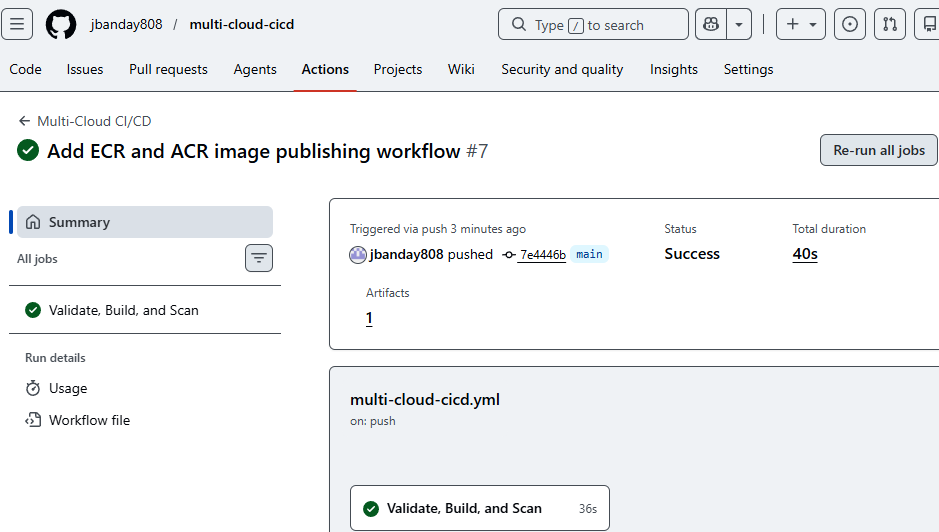
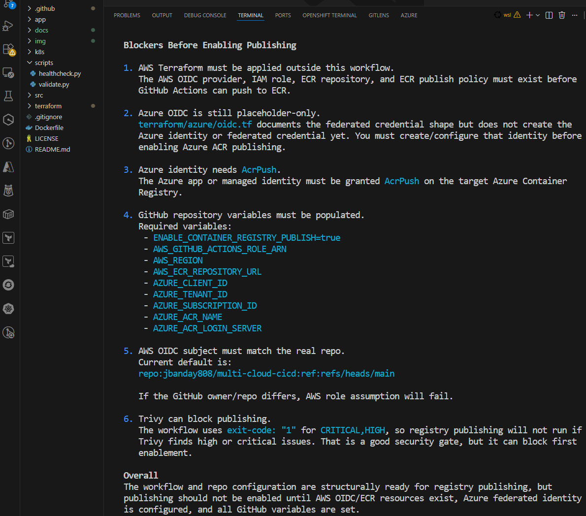

# Multi-Cloud CI/CD Pipeline

## Project Overview

This project automates the process of testing, building, scanning, and preparing an application for deployment across AWS and Azure.

It shows how a software team can use one repeatable process to move code from GitHub toward cloud deployment. Instead of manually checking code, building containers, and preparing cloud resources, the pipeline handles those steps automatically.

The goal is simple: make software delivery faster, safer, and more consistent across more than one cloud provider.

## Architecture Diagram

Figure 1. Multi-Cloud CI/CD Pipeline architecture showing GitHub Actions, Docker, security scanning, OIDC authentication, and deployment preparation across AWS and Azure.

## Why This Project Matters

Organizations want to release software faster without lowering quality or security. Manual deployment steps can slow teams down and create mistakes, especially when applications need to run in more than one cloud.

This project demonstrates how automation can reduce manual effort, improve consistency, and support secure delivery across AWS and Azure. It is a practical example of how DevOps practices help teams move from code changes to cloud-ready applications with fewer repeated manual tasks.

## What I Built

I built a multi-cloud CI/CD pipeline that automates application validation, containerization, security scanning, and infrastructure provisioning across AWS and Azure.

## Real-World Use Case

A company may have customers, applications, or teams using both AWS and Azure. Without a shared process, the company may need separate deployment workflows for each cloud provider.

This project shows a simpler approach. One automated workflow can check the application, build it, scan it, and prepare it for deployment to both cloud environments. This helps teams avoid duplicated effort and keeps the release process more consistent.

## Diagram Explanation

The architecture diagram shows a multi-cloud CI/CD pipeline. It follows the path from a code change to a cloud-ready application.

- **Code Push:** A developer sends code to GitHub.
- **GitHub Actions:** GitHub automatically starts the workflow.
- **Test:** The code is checked automatically to catch basic issues early.
- **Build:** A Docker image is created. This packages the application so it can run consistently in different environments.
- **Scan:** The Docker image is checked for security issues before it is prepared for deployment.
- **AWS Deployment:** The image can be pushed to Amazon ECR and deployed to ECS or EKS.
- **Azure Deployment:** The image can be pushed to Azure ACR and deployed to AKS or App Service.
- **OIDC:** Secure temporary access is used instead of stored passwords or long-term access keys.

In simple terms, the diagram shows one workflow that can prepare the same application for both AWS and Azure. The project is designed to build once and deploy everywhere using one codebase.

## Architecture Diagram Walkthrough

1. Developer pushes code to GitHub.
2. GitHub Actions starts automatically.
3. Validation checks run to make sure the application is in a good state.
4. A Docker image is built so the application can run consistently.
5. A security scan is performed with Trivy to check the image for known issues.
6. The image is prepared for cloud deployment.
7. OIDC provides secure temporary authentication without storing long-term passwords or keys.
8. The application can be deployed to AWS and Azure.

## Workflow Validation

Figure 2. GitHub Actions workflow successfully validating code, building the Docker image, performing a Trivy security scan, and preparing the application for multi-cloud deployment.

The GitHub Actions workflow runs automatically after code is pushed. The pipeline validates the application, builds a Docker image, performs a security scan, and uploads artifacts.

The successful workflow execution confirms the CI pipeline is functioning correctly.

## Publishing Readiness Check

Figure 3. Publishing readiness check validating AWS OIDC, Azure identity configuration, GitHub variables, container registry requirements, and security controls before enabling automated image publishing.

The readiness assessment identifies all prerequisites required before enabling automated image publishing. It validates AWS OIDC configuration, Azure federated identity requirements, GitHub Actions variables, ECR/ACR publishing requirements, and security controls.

This step helps ensure secure and reliable container publishing to AWS and Azure.

## For Everyone

You write code once, push it to GitHub, and the system automatically checks it, packages it, scans it for security problems, and prepares it for deployment to AWS and Azure.

This helps teams avoid manual steps, reduce mistakes, and keep the delivery process consistent.

## Business Value

- **Secure:** No long-term secrets need to be stored in the pipeline.
- **Fast:** The process from code to deployment preparation is automated.
- **Multi-cloud:** The same application can work across AWS and Azure.
- **Reliable:** The same steps run every time, which makes releases more repeatable.
- **Cost-effective:** The project uses cloud services efficiently and keeps the deployment process organized.

## Key Skills Demonstrated

- GitHub Actions
- CI/CD Automation
- Docker
- Kubernetes
- Terraform
- AWS
- Azure
- Infrastructure as Code (IaC)
- Security Scanning (Trivy)
- Multi-Cloud Architecture
- DevOps Best Practices

## Resume Value

This project demonstrates skills that employers look for in cloud, DevOps, and platform engineering roles:

- Automation
- Cloud engineering
- Security
- Infrastructure management
- CI/CD pipelines
- Multi-cloud deployments

It shows the ability to connect application delivery, containerization, cloud infrastructure, and security scanning into one organized workflow.

## Current Status

The project currently includes:

- GitHub Actions CI workflow
- Python validation
- Docker build
- Trivy security scan
- Kubernetes manifests
- AWS Terraform foundation
- Azure Terraform foundation
- GitHub OIDC authentication foundation
- AWS ECR publishing workflow
- Azure ACR publishing workflow
- Publishing readiness validation

## Future Roadmap

Planned next steps include:

- GitHub OIDC for AWS
- GitHub OIDC for Azure
- Push image to AWS ECR
- Push image to Azure ACR
- Deploy to EKS
- Deploy to AKS

# References

Official documentation links for the major tools, platforms, and services used in this project.

## GitHub

### GitHub Actions

Official automation platform used to run validation, build, security scan, and publishing workflows from GitHub.

Reference:  
https://docs.github.com/en/actions

### GitHub OIDC

Official GitHub feature used to request secure temporary cloud access without storing long-term cloud keys.

Reference:  
https://docs.github.com/en/actions/security-for-github-actions/security-hardening-your-deployments/about-security-hardening-with-openid-connect

## Containerization

### Docker

Official container platform used to build and package applications into portable images.

Reference:  
https://docs.docker.com/

## Infrastructure as Code

### Terraform

Official Infrastructure as Code tool used to define and manage cloud resources in repeatable configuration files.

Reference:  
https://developer.hashicorp.com/terraform/docs

## AWS

### Amazon ECR

Official AWS container registry service used to store Docker images for AWS deployments.

Reference:  
https://docs.aws.amazon.com/ecr/

### Amazon EKS

Official AWS managed Kubernetes service that can run containerized applications on AWS.

Reference:  
https://docs.aws.amazon.com/eks/

### AWS IAM

Official AWS identity and access management service used to control permissions and cloud access.

Reference:  
https://docs.aws.amazon.com/iam/

### AWS OIDC Federation

Official AWS federation approach used to allow GitHub Actions to assume AWS roles with short-term credentials.

Reference:  
https://docs.aws.amazon.com/IAM/latest/UserGuide/id_roles_providers_create_oidc.html

## Azure

### Azure Container Registry (ACR)

Official Azure container registry service used to store Docker images for Azure deployments.

Reference:  
https://learn.microsoft.com/en-us/azure/container-registry/

### Azure Kubernetes Service (AKS)

Official Azure managed Kubernetes service that can run containerized applications on Azure.

Reference:  
https://learn.microsoft.com/en-us/azure/aks/

### Microsoft Entra ID (Azure AD)

Official Microsoft identity platform used to manage users, applications, permissions, and cloud authentication.

Reference:  
https://learn.microsoft.com/en-us/entra/fundamentals/

### Azure OIDC Federation

Official Azure authentication approach used to let GitHub Actions access Azure with federated credentials.

Reference:  
https://learn.microsoft.com/en-us/azure/developer/github/connect-from-azure-openid-connect

## Kubernetes

### Kubernetes

Official container orchestration platform used to define and run containerized applications.

Reference:  
https://kubernetes.io/docs/

## Security

### Trivy

Official vulnerability scanner used to check Docker images for known security issues.

Reference:  
https://aquasecurity.github.io/trivy/

## Programming

### Python

Official programming language used for the sample application in this project.

Reference:  
https://docs.python.org/3/

# Author

## James Banday

Cloud | DevOps | Cybersecurity | Multi-Cloud Engineering

LinkedIn:  
https://www.linkedin.com/in/james-allen-morta-banday-62a391128/

GitHub Repository:  
https://github.com/jbanday808/multi-cloud-cicd

This project demonstrates hands-on experience with GitHub Actions, Docker, Terraform, AWS, Azure, Kubernetes, security scanning, OIDC authentication, and multi-cloud CI/CD automation.
