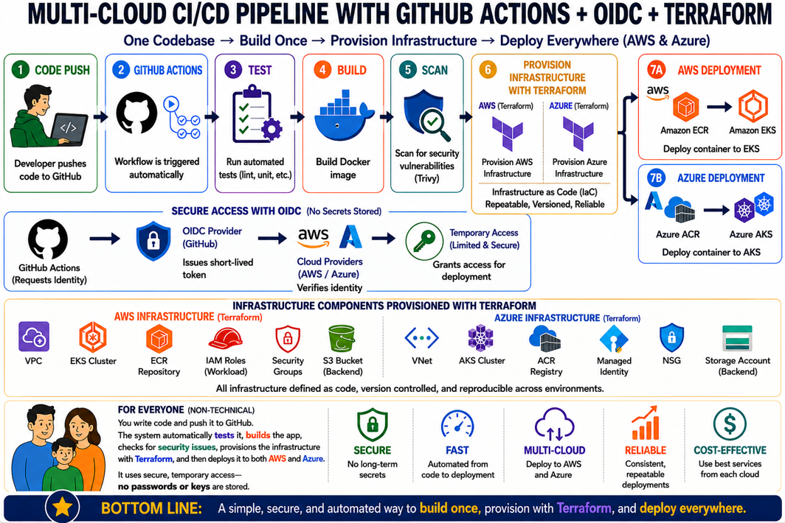

# Architecture Overview

This project shows a multi-cloud delivery pipeline for a small web application. The goal is to make the process of checking, packaging, scanning, and preparing an application for cloud deployment automatic and repeatable.

In simple terms, a developer writes code once and pushes it to GitHub. GitHub then starts an automated workflow that checks the application, builds a Docker image, scans it for security issues, and prepares it to be published to both AWS and Azure.

The architecture is designed around one main idea: use one codebase and one automated process to support more than one cloud provider.

## Workflow Overview

When code is pushed to GitHub, the project follows these steps:

1. **Code is pushed to GitHub.**  
   A developer sends the latest version of the project to the GitHub repository.

2. **GitHub Actions starts automatically.**  
   GitHub Actions is the automation tool built into GitHub. It watches for code changes and runs the project workflow without someone starting it by hand.

3. **The application is validated.**  
   The workflow checks the Python application to make sure the code can be read and prepared correctly.

4. **A Docker image is built.**  
   Docker packages the application and everything it needs into a portable image. This helps the application run the same way in different environments.

5. **The image is scanned for security issues.**  
   The workflow uses Trivy to check the Docker image for known security problems before it is published.

6. **The image is prepared for AWS and Azure.**  
   After validation, build, and scanning, the image can be published to cloud container registries.

7. **The image is published to container registries.**  
   AWS uses Amazon ECR, and Azure uses Azure ACR. These services store Docker images so they can later be deployed to cloud services.

This process helps reduce manual steps and makes each release more consistent.

## Infrastructure Overview

The project includes Terraform configuration for both AWS and Azure.

Terraform is a tool that describes cloud infrastructure using files. Instead of manually clicking through cloud dashboards, Terraform lets teams define cloud resources in a repeatable way.

### AWS

AWS is one of the cloud providers supported by this project.

The AWS foundation includes:

- A network foundation for future cloud deployments.
- Amazon ECR for storing Docker images.
- OIDC-based access for GitHub Actions.
- IAM permissions for publishing images to ECR.

Amazon ECR stands for Elastic Container Registry. It is a secure storage location for Docker images in AWS.

### Azure

Azure is the second cloud provider supported by this project.

The Azure foundation includes:

- A resource group for organizing cloud resources.
- A virtual network foundation for future cloud deployments.
- Azure Container Registry for storing Docker images.
- Placeholder guidance for OIDC-based access from GitHub Actions.

Azure ACR stands for Azure Container Registry. It is Azure's service for storing Docker images.

## Security Overview

Security is built into the workflow in several ways.

### OIDC Access

OIDC provides secure temporary access between GitHub Actions and the cloud providers.

Instead of storing long-term passwords or access keys in GitHub, GitHub Actions requests short-term access only when the workflow runs. AWS and Azure check that the request came from the approved GitHub repository before allowing access.

This reduces the risk of leaked cloud credentials.

### Image Scanning

Before the Docker image is published, the workflow scans it with Trivy. This helps identify known security issues early in the process.

If serious issues are found, the workflow can stop before the image is published.

### Controlled Publishing

The workflow publishes images only from push events. Pull requests can still validate, build, and scan the application without publishing images to AWS or Azure.

This helps separate review activity from release activity.

## Business Benefits

This architecture provides several practical benefits:

- **Faster delivery:** The workflow runs automatically after code is pushed.
- **Fewer manual steps:** Developers do not need to manually build, scan, and prepare images.
- **More consistency:** The same process runs every time.
- **Better security:** OIDC avoids long-term cloud keys, and Trivy checks images before publishing.
- **Multi-cloud flexibility:** The same application can be prepared for both AWS and Azure.
- **Improved reliability:** Repeatable automation lowers the chance of human error.

For hiring managers and interviewers, this project demonstrates an understanding of modern software delivery, cloud platforms, automation, containerization, and secure access management.

## Summary

This project is a portfolio-ready example of a multi-cloud CI/CD pipeline.

It shows how GitHub Actions, Docker, Terraform, AWS, Azure, ECR, ACR, OIDC, and security scanning can work together in one automated workflow.

The main value is simple: write the code once, let automation check and package it, scan it for security issues, and prepare it for deployment across multiple cloud providers.
