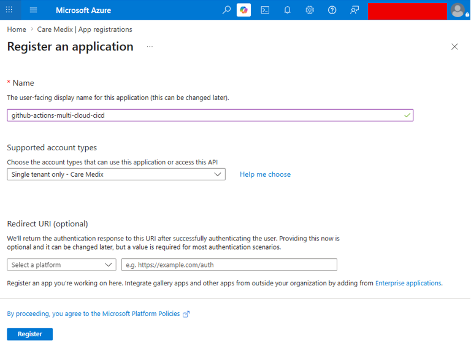

# Security Overview

This project includes several security controls that help reduce risk while preparing an application for AWS and Azure.

The main security goal is simple: allow automation to work without storing long-term cloud passwords, and check the application container before it is published.

The project focuses on secure access, container scanning, controlled permissions, and repeatable infrastructure.

## Identity and Access Management

Identity and access management controls who can access cloud resources and what they are allowed to do.

## Secure Authentication with OIDC

Figure 1. GitHub Actions OIDC federation configured for secure cloud authentication without long-term credentials.

OIDC helps the project connect GitHub Actions to AWS and Azure without hardcoded passwords. Instead of saving permanent cloud keys in the repository, the workflow requests temporary cloud credentials only when it runs.

This reduces security risk because there are no long-term cloud passwords to leak from the codebase. It also supports both AWS and Azure authentication, which keeps the multi-cloud pipeline safer and easier to manage.

### GitHub OIDC Authentication

GitHub OIDC allows GitHub Actions to connect to AWS and Azure without storing permanent cloud passwords in GitHub.

In plain language, GitHub proves to AWS and Azure that a workflow is coming from the approved repository. If the request is trusted, the cloud provider gives the workflow short-term access.

Why this matters:

- It reduces the risk of leaked cloud keys.
- It avoids storing long-term passwords in GitHub.
- It helps ensure only approved workflows can access cloud resources.

### Temporary Credentials

Temporary credentials are short-lived access tokens. They are created only when the workflow runs and expire after a limited time.

Why this matters:

- If temporary credentials are exposed, they are useful only for a short time.
- They are safer than long-term access keys.
- They support modern cloud security practices.

### No Hardcoded Cloud Passwords

The project avoids hardcoding AWS or Azure passwords in the codebase.

Why this matters:

- Hardcoded passwords can be accidentally committed to source control.
- Removing long-term secrets lowers the chance of credential theft.
- It makes the project safer to share as a portfolio or team project.

### IAM Least-Privilege Access

AWS IAM permissions are focused on the current task: publishing Docker images to Amazon ECR.

The GitHub Actions role does not include broad administrator access and does not include EKS deployment permissions.

Why this matters:

- The workflow receives only the access it needs.
- A mistake in the pipeline has a smaller impact.
- It follows the security principle of least privilege.

### Azure AcrPush Role Assignment

For Azure, the identity used by GitHub Actions should receive the `AcrPush` role on Azure Container Registry.

This role allows the workflow to push Docker images to ACR without giving it unnecessary access to unrelated Azure resources.

Why this matters:

- The workflow can publish images without broad Azure permissions.
- Access is limited to the container registry task.
- It reduces risk if the workflow is misconfigured.

## Container Security

Container security focuses on checking the Docker image before it is published.

### Trivy Vulnerability Scanning

The project uses Trivy to scan the Docker image for known security issues.

The scan runs before image publishing. If serious issues are found, the workflow can stop before the image is sent to AWS ECR or Azure ACR.

Why this matters:

- Security checks happen early in the delivery process.
- Risky images can be blocked before they reach cloud registries.
- Teams get a scan report they can review and fix.

### Controlled Image Publishing

The workflow publishes images from push events, not from pull request review activity.

Why this matters:

- Review activity is separated from release activity.
- Images are published only during the intended workflow path.
- It helps keep the registry cleaner and more controlled.

## Infrastructure Security

Infrastructure security focuses on how cloud resources are created and managed.

### Infrastructure as Code with Terraform

Terraform is used to define AWS and Azure resources in files.

Instead of manually creating resources in cloud dashboards, the infrastructure can be reviewed, versioned, and repeated.

Why this matters:

- Infrastructure changes can be reviewed before they are applied.
- The same setup can be recreated consistently.
- It reduces manual mistakes.
- It creates a clearer record of how cloud resources are configured.

### Repeatable and Auditable Deployments

The workflow and Terraform files make the deployment process easier to repeat and audit.

Repeatable means the same steps can run the same way each time. Auditable means the process can be reviewed later.

Why this matters:

- Teams can understand what changed and when.
- Manual one-off changes are reduced.
- Troubleshooting becomes easier.
- The process is easier to explain to stakeholders.

## Cloud Security

This project includes security controls for both AWS and Azure.

### AWS Security Controls

The AWS side includes:

- GitHub OIDC provider.
- IAM role for GitHub Actions.
- Limited ECR publishing permissions.
- ECR image tag immutability.

Why this matters:

- GitHub Actions can publish images without permanent AWS keys.
- The role is limited to the current publishing task.
- Immutable tags help prevent an existing image tag from being overwritten.

### Azure Security Controls

The Azure side includes:

- OIDC setup guidance for GitHub Actions.
- Federated identity credential placeholders.
- Azure Container Registry for image storage.
- `AcrPush` role guidance for limited registry access.

Why this matters:

- GitHub Actions can use temporary Azure access.
- The identity can be limited to pushing images only.
- Registry access can be controlled without giving broad Azure permissions.

## Benefits

These security controls provide practical business value:

- **Lower credential risk:** No long-term cloud passwords are stored in the repository.
- **Better control:** Cloud access is limited to the workflow and task.
- **Earlier security checks:** Images are scanned before publishing.
- **More reliable releases:** Automation reduces manual mistakes.
- **Audit-friendly process:** Workflow and infrastructure files can be reviewed.
- **Multi-cloud consistency:** AWS and Azure follow the same security approach.

## Summary

This project uses modern security practices to support a safer multi-cloud delivery process.

The most important controls are GitHub OIDC authentication, temporary credentials, no hardcoded cloud passwords, Trivy image scanning, least-privilege AWS IAM access, Azure `AcrPush` permissions, and Terraform-based infrastructure.

Together, these controls reduce risk, improve consistency, and make the project easier to review, explain, and extend.
